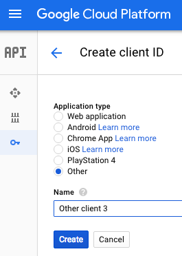
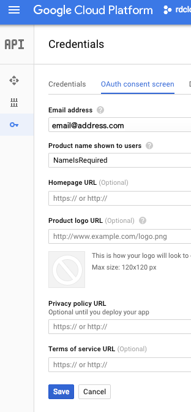
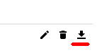

#google-api-credentials-php71

A php 7.1 console application to help with credentials on google app engine/google cloud based on: 

https://developers.google.com/gmail/api/quickstart/php

**This is a console application that interacts with local files, please take when handling files with secrets.** 

## Installation

- clone this project

- install packages

```
composer install

or

docker run --rm -v $(pwd):/app jamesway/php71-cli-dev composer install
```


## Usage

generate an api client secret json file in the google cloud console

- create a client id  



- define the consent screen if necessary (only email and project name are required)



- download the client secret as json  



- put rename and put secret.json in /secret

- run
```
php google_api_creds.php

or 

# note the -itv
docker run --rm -itv $(pwd):/app jamesway/php71-cli-dev php google_api_creds.php
```

- copy the link into your browser

- select an account to grant api access

- copy the access code and paste it into the console

- you should have a fresh credentials.json in /secret

## Optional

Put the credentials into google cloud datastore so that you can access it from App Engine


